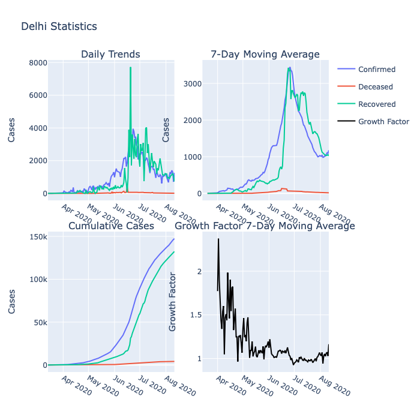
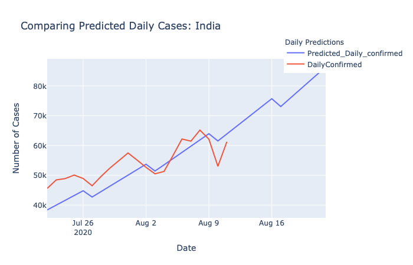

# Covid 19 : India Analysis and Forecasting

This is an end-end data science project that fetches the daily updated data released about the spread of the virus, and performs exploratory data analysis, visualisations and predictive modelling on the data. 
    It calculates and visualizes the growth factor, growth ratio of the virus and draws insights from it. These are used as features and the spread of the virus is modelled using Ridge Regression.

    
1. Analysis and Visualization [Notebook.](https://nbviewer.jupyter.org/github/DnanaDev/Covid19-India-Analysis-and-Forecasting/blob/master/COVID19_India_Analysis_Forecasting.ipynb)
2. Data Scraping [Script.](india_API_data/Covid19_india_org_api.py)
3. Kaggle Forecasting Week 1 Challenge [Notebook.](https://www.kaggle.com/andynath/covid-19-beginner-eda-random-forest-xgboost) 

State Wise Analysis            |  Predictions/Forecast
:-------------------------:|:-------------------------:
  |  

## Data Sources
1. Daily Case Statistics: [covid19india.org API.](https://github.com/covid19india/api)
2. Daily ICMR Testing Samples Data: [Data Meet.](https://github.com/datameet/covid19)

