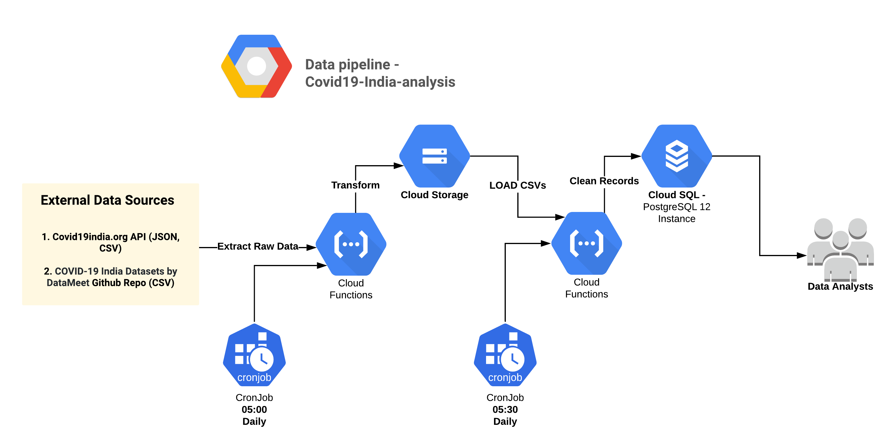

# Data Pipeline For COVID-19 - India Analysis
_**Documentation for data pipeline created for the mentorskool community project COVID-19**_

The project provides an automated ETL pipeline that collects data related to the Covid outbreak from APIs, web sources etc. and provides analysts access to consistent, clean and up to date data. The Pipeline is hosted on the <b>Google Cloud Platform</b> and has the following components: 

### 1. Raw Data Ingestion Functions
1. Cloud Function - [fetch_raw_covid_api_data](Data_Pipeline/GCP_Cloud_function.py)
2. Offline Function - [Script](Data_Pipeline/Data_Ingestion.py) - [Documentation](Documentation/Ingestion.md)

### 2. Clean SQL Ingestion Functions
1. Cloud Function - [Cloud_function_Ingestion_SQL](Data_Pipeline/Cloud_function_Ingestion_SQL.py)
2. Functions for Creating Local DB (Used pg_dump to create CloudSQL Instance), Connecting to CloudSQL , Offline Clean Data Ingestion - [Well documented notebook](Data_Pipeline/Data_Ingestion.ipynb)
3. Current DB [ERD](Documentation/DB_ERD.png)
