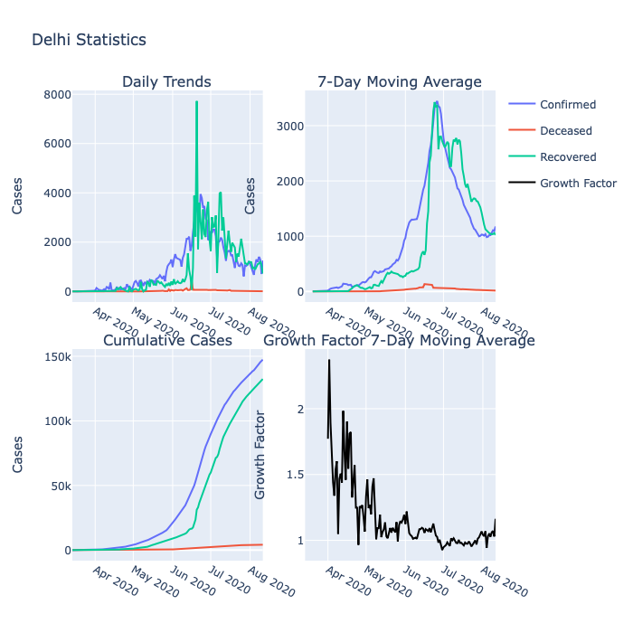
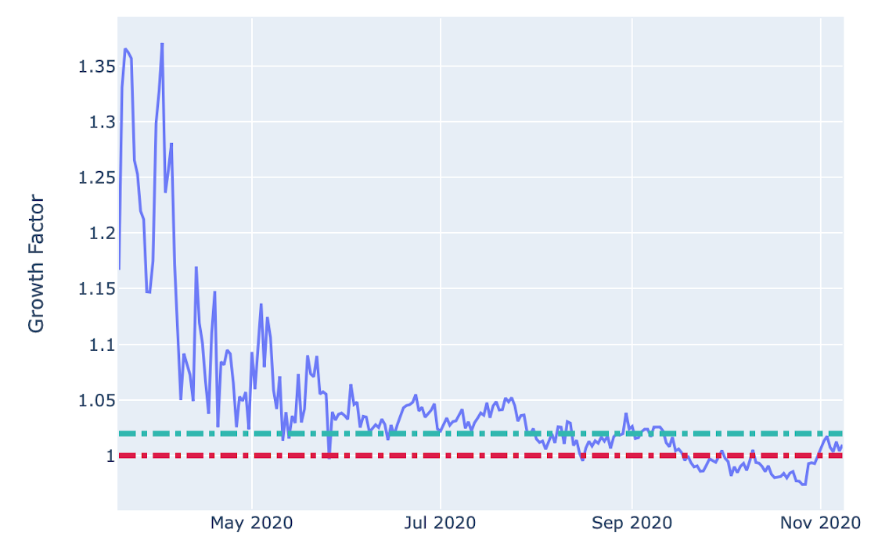
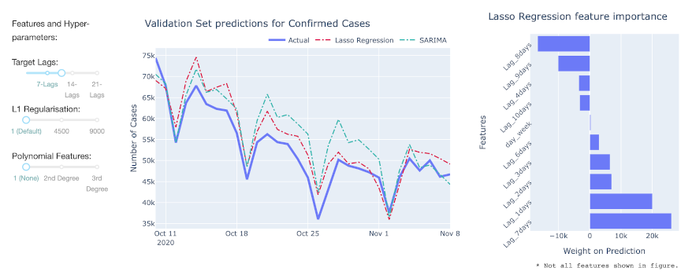

# Covid 19 : India Analysis and Forecasting

 Dashboard for analysing and forecasting the spread of the pandemic using curve fitting, Time-Series forecasting and Supervised Machine Learning models and metrics. 

    
1. Plotly-Dash [Dashboard.](https://covid-dashboard-jwn6dxvs6a-ts.a.run.app)
2. Analysis and Visualization [Notebook.](https://nbviewer.jupyter.org/github/DnanaDev/Covid19-India-Analysis-and-Forecasting/blob/master/COVID19_India_Analysis_Forecasting.ipynb)
3. Data Ingestion [Script.](Data/india_API_data/Covid19_india_org_api.py)

|  |  |
| --- | --- |
| **National/State-Wise Analysis** |  |
|**Growth-Factor/Ratio**||
|**Cases Forecast** (SARIMAX, Lasso Regresion, Logistic-Fit, Growth Ratio)||

## Data Sources
1. Daily Case Statistics: [covid19india.org API.](https://github.com/covid19india/api)
2. Daily ICMR Testing Samples Data: [Data Meet.](https://github.com/datameet/covid19)

