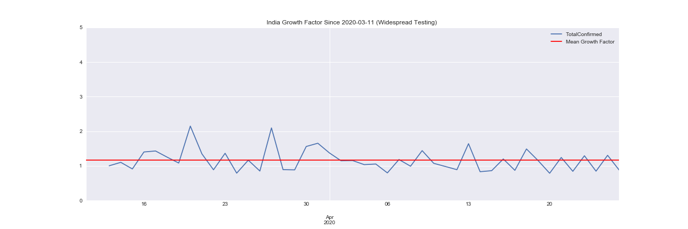

# Covid 19 : India Analysis and Forecasting

This is an end-end data science project that fetches the daily updated data released about the spread of the virus, and performs some exploratory data analysis and visualisations on the data. 
    It calculates and visualizes the growth factor, growth ratio of the virus and draws insights from it. The further spread of the virus is modelled using a polynomial regression.

    1. Analysis and Visualization [Notebook.](COVID19_India_Analysis_Forecasting.ipynb)
    2. Data Scraping [Script.](india_API_data/Covid19_india_org_api.py)
    3. Kaggle Forecasting Week 1 Challenge [Notebook.](https://www.kaggle.com/andynath/covid-19-beginner-eda-random-forest-xgboost)

## Data Sources
1. Daily Case Statistics: [covid19india.org API.](https://github.com/covid19india/api)
2. Daily ICMR Testing Samples Data: [Data Meet.](https://github.com/datameet/covid19)

